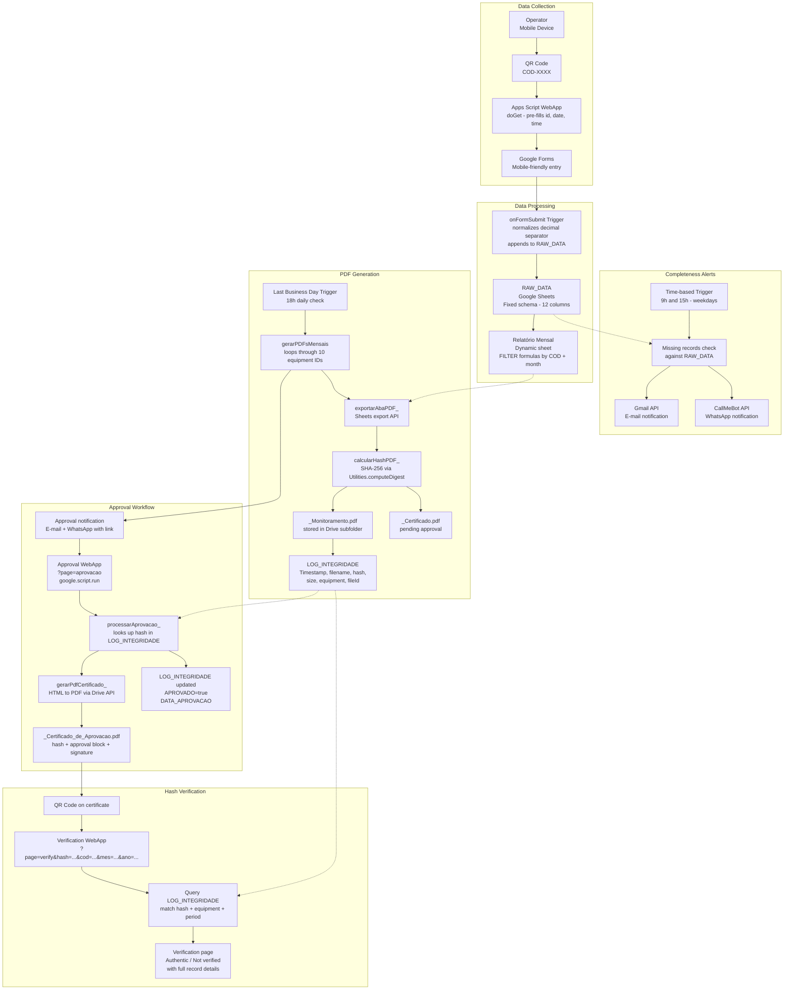

# System Architecture

## Architecture Diagram

---

## Architectural Decisions

### Google Apps Script as the sole backend

The entire backend runs on Google Apps Script — no external servers, no infrastructure to maintain. The environment already used Google Workspace, so a zero-infrastructure approach eliminated deployment friction and ongoing operational overhead.

The tradeoff is a 6-minute execution limit per run and the absence of a proper database. PDF generation is batched with `Utilities.sleep()` between iterations and rate-limit retry logic to stay within bounds. Google Sheets acts as a structured storage layer with a fixed schema enforced on every write.

### Google Sheets as a relational-like data store

RAW_DATA uses a fixed 12-column schema enforced on every `onFormSubmit` call. It behaves like a database table for this workload — filterable by equipment ID, date and shift using Sheets' native `FILTER` formula engine. The monthly report sheet pulls data dynamically via `FILTER + DATEVALUE + DAY/MONTH/YEAR` without any data duplication.

A proper database (Firestore, PostgreSQL) would require an external backend and authentication layer that was out of scope for this deployment context.

### SHA-256 for document integrity

Each generated PDF is hashed using `Utilities.computeDigest(SHA_256)` before storage. The hash is written to LOG_INTEGRIDADE alongside file metadata — creating a tamper-evident record. If the PDF is modified after generation, recomputing the hash will produce a different value and the verification page will flag it as unverified.

This closes the audit loop: generation → hash → approval → QR code on certificate → live verification page — all traceable to a single record in LOG_INTEGRIDADE.

### google.script.run as the approval bridge

The approval interface runs inside a Google-hosted iframe (googleusercontent.com sandbox). Both `fetch()` calls and direct navigation to `script.google.com` are blocked by the browser's cross-origin policy in this context — a non-obvious constraint that caused multiple failed approaches before the root cause was identified.

`google.script.run` is the official HtmlService bridge for calling server-side functions from within the sandbox. It bypasses the cross-origin restriction because it communicates through Google's internal postMessage channel rather than HTTP.

### Public wrapper for google.script.run callable functions

Apps Script treats functions with a trailing underscore (e.g. `processarAprovacao_`) as private — they are invisible to `google.script.run` and fail silently without a meaningful error message. The debugging cycle here was non-trivial: the call appeared to succeed at the JavaScript layer but returned `false` from the success handler with no server-side log entry.

The solution was a thin public wrapper `aprovarRelatorio(cod, mes, ano)` that delegates to the private function. This also improves separation between the public API surface and internal implementation.

### Date object vs string in LOG_INTEGRIDADE

The MES_ANO column in LOG_INTEGRIDADE was populated using `mesFormatado + "/" + ano` (e.g. `"04/2026"`), but Google Sheets silently converted it to a Date object (`2026-04-01T03:00:00.000Z`) based on the column's cell format. String comparison against `"04/2026"` always failed, causing the hash lookup to return no results.

The fix uses `instanceof Date` to detect the stored type and `Utilities.formatDate(cell, timezone, "MM/yyyy")` to normalize before comparison — making the lookup format-agnostic regardless of how Sheets chooses to interpret the cell.

### Decimal separator normalization

Google Forms on mobile devices running non-Brazilian locale settings submit decimal numbers with a period separator (e.g. `23.5`). Google Sheets in PT-BR interprets period-separated decimals as text strings rather than numbers, breaking the `FILTER` formula comparisons in the monthly report.

The normalization happens at ingestion time inside `onFormSubmit` via `String(val).trim().replace(".", ",")` — before the value reaches RAW_DATA. This makes the storage layer locale-independent regardless of the operator's device settings.

### ZPL for equipment labels

QR code labels were initially generated as PNG images via `api.qrserver.com` and printed through ZebraDesigner. Thermal printers render raster images with visible degradation at 203 DPI — the QR modules became uneven and scan reliability dropped.

Migrating to ZPL (Zebra Programming Language) solved this: ZPL instructs the printer to generate the QR code natively using its internal rasterizer, producing crisp vector output at any size. The ZPL files are generated programmatically with the correct equipment URL embedded in the `^BQN` command, then sent directly to the printer via Zebra Setup Utilities.

---

## Known Limitations and Planned Improvements

- **Approval latency**: PDF generation and certificate creation involve multiple Drive API calls. Occasional delays of 4–5 seconds per equipment are expected; timeouts are rare and self-resolving on retry. *(Planned: batch processing optimization and async status feedback in the approval UI)*

- **No real-time data**: Monitoring currently relies on manual form submission via QR code. Missing records are caught by the 9h/15h alert system, but there is no automatic sensor reading. *(Planned: IoT webhook endpoint for ESP32/DHT22 sensors — the `FONTE` field in RAW_DATA is already reserved with value `"iot"` to support this without schema changes)*

- **Single approver**: The approval workflow is hardcoded to one PCQI. Approver identity is not verified beyond Google account access to the WebApp URL. *(Planned: multi-approver support with role definition in a Sheets configuration tab and per-approver signature file reference)*

- **Hardcoded configuration**: `CONFIG` and `ALERTA` objects are defined directly in the script. Any change requires a code edit and redeployment. *(Planned: extract all configuration parameters to a dedicated Sheets tab, making the system fully configurable without touching the codebase)*

- **Personal Google account ownership**: The system runs under a personal account, creating a bus factor risk if the responsible developer leaves. *(Planned: migration to an institutional Google Workspace account before the next FSSC 22000 audit cycle)*

