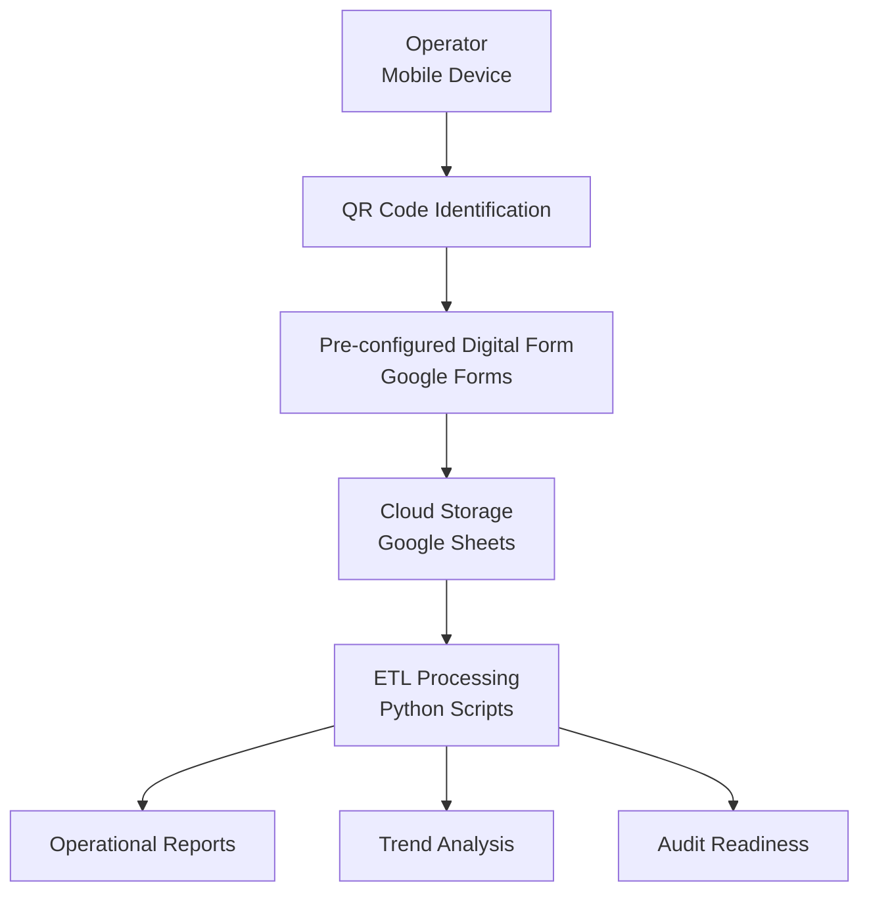

# System Architecture

## Architecture Goals

* low operational friction
* high traceability
* audit readiness
* low-cost infrastructure
* workflow reliability
* scalable automation pipeline

⸻

## Reliability Considerations

The architecture was designed to reduce manual transcription steps and improve operational traceability while maintaining low infrastructure complexity.
