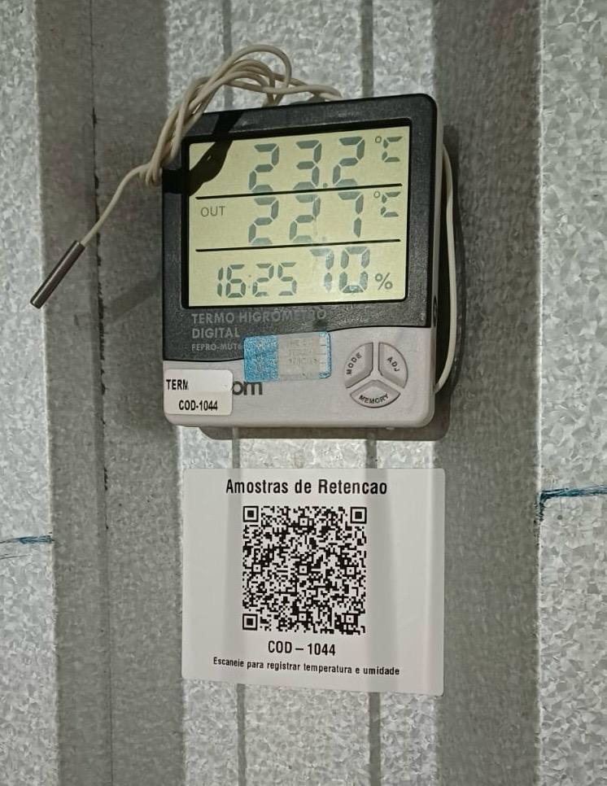
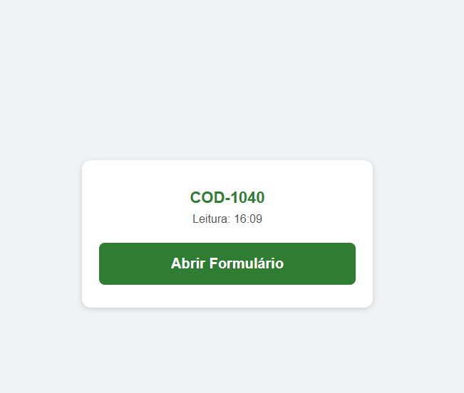
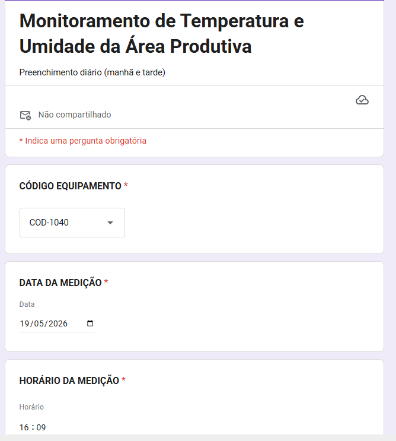
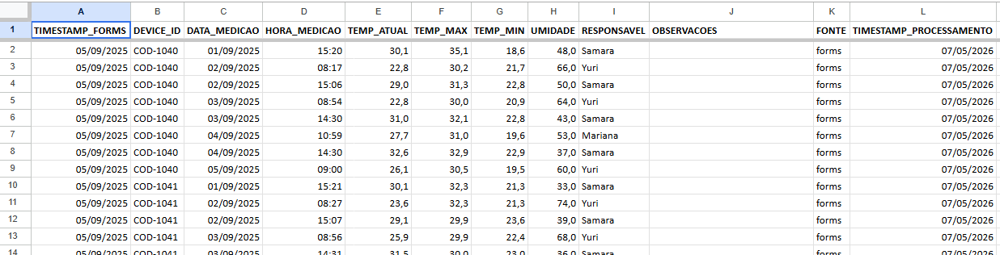
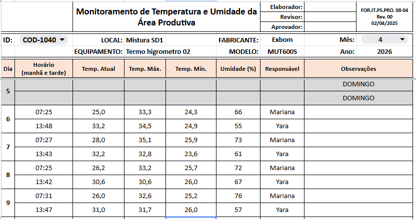
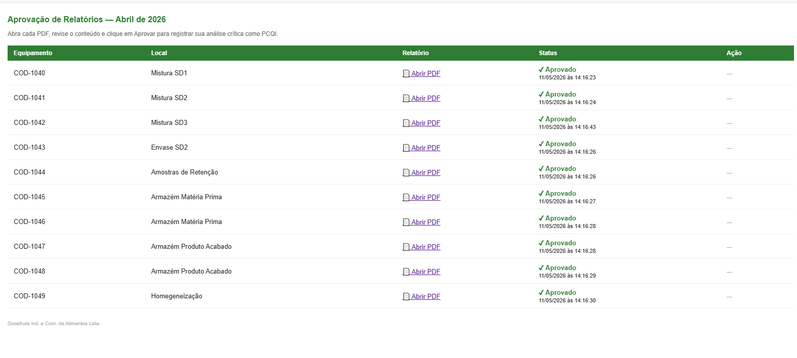
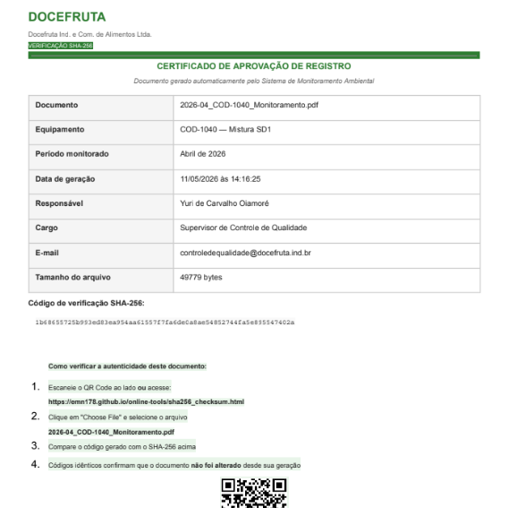
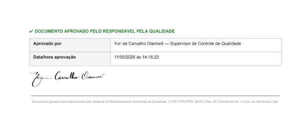
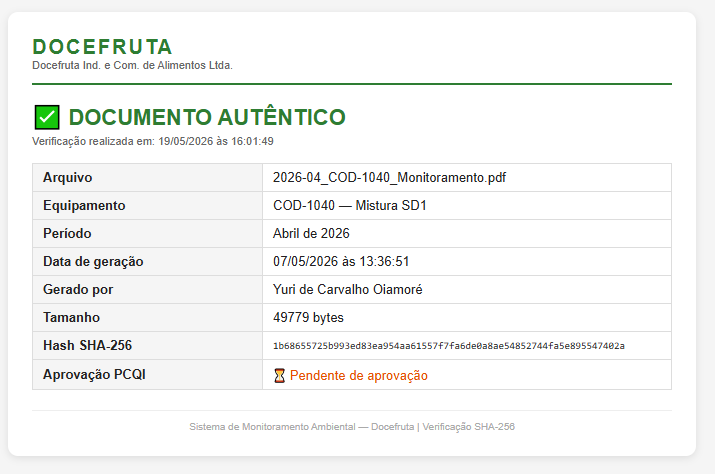

# Operational Screenshots

All screenshots and photos in this section are from the live production system. Sensitive identifiers have been anonymized where applicable.

---

## 1. Equipment with QR Code Label

Monitoring equipment installed in a production area, with the ZPL-printed identification label below. The label was generated programmatically and printed directly via Zebra Setup Utilities using native ZPL commands — no image conversion required.



---

## 2. QR Code Scan Confirmation

After scanning the QR code, the operator sees a confirmation screen showing the equipment ID and scan timestamp. Tapping "Abrir Formulário" opens the pre-filled Google Form.



---

## 3. Pre-filled Google Form

The monitoring form opens with equipment ID, date, and time already populated from the QR code URL parameters. The operator only needs to enter temperature and humidity readings, responsible name, and any observations.



---

## 4. RAW_DATA Storage Layer

The RAW_DATA sheet stores every submitted record with a fixed 12-column schema. Each row is written by the `onFormSubmit` trigger, with decimal normalization and timestamp processing applied before storage.



---

## 5. Monthly Monitoring Report

The monthly report sheet pulls data dynamically from RAW_DATA using FILTER formulas indexed by equipment ID, month, year, and shift. Weekends are identified automatically. The sheet is exported as a PDF on the last business day of each month.



---

## 6. Digital Approval Workflow

The approval interface lists all 10 equipment stations with links to their PDF reports and real-time approval status. The PCQI reviews each report and approves directly in the browser. Approval timestamps are recorded to the second.



---

## 7. Approval Certificate

Each approved report generates a tamper-evident certificate containing the document metadata, SHA-256 hash, verification QR code, and approval block with the PCQI's signature and timestamp.





---

## 8. Hash Verification Page

Scanning the QR code on any certificate opens a live verification page that queries LOG_INTEGRIDADE and confirms document authenticity in real time. The page displays the full record details including generation timestamp, file size, hash, and approval status.



---

## System Flow Summary

```
Equipment QR scan (photo 1)
    → Confirmation screen (screenshot 2)
    → Pre-filled form submission (screenshot 3)
    → RAW_DATA ingestion (screenshot 4)
    → Monthly report generation (screenshot 5)
    → Digital approval (screenshot 6)
    → Tamper-evident certificate (screenshots 7a, 7b)
    → Live hash verification (screenshot 8)
```

